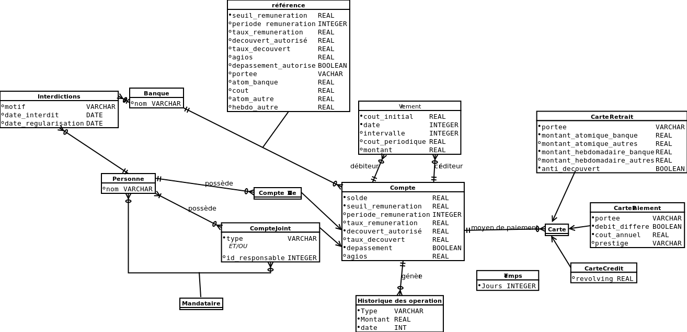

BankBDav
========

Projet Bases de données avancées
===

##Diagramme
  

Légende : 
* cercle noir : NOT NULL
* cercle blanc : NULLABLE
* souligné : PRIMARY KEY

Notes : 
* Pas de liens d'ID pour l'instant, on verra à l'implémentation.
* Virement : jour est entre 1 et 31, c'est le jour du mois où on vire.
* Virement : intervalle vaut 1, 3, 6 ou 12 selon la période en mois.
* Compte : periode_remuneration vaut 1 (par jour), 15 (quinzaine) ou 30 (mois).
* Cartes : portee est "banque"/"nationale"/"internationale".
* CarteRetrait : anti_decouvert dit si on peut retirer plus que notre solde.
* CartePaiement : prestige est "Premier"/"Gold"/"Platinium".

##Schéma relationnel

##A faire

**Mettre une * si le truc est fait (il peut toujours y avoir des modifications.**  
Modéliser tout.*  
Schéma relationnel de ce qu'on implémente.  
Création des tables.  
Ouverture d'un compte.  
Fermeture d'un compte.  
Consultation du solde.  
Retrait d'espèces.  
Virement entre comptes d'une banque.  
Virement périodique (par mois).  
Interdiction bancaire.  

